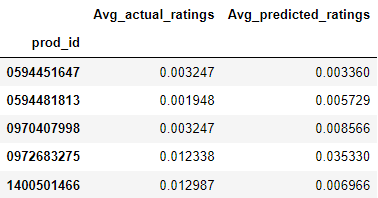
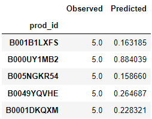
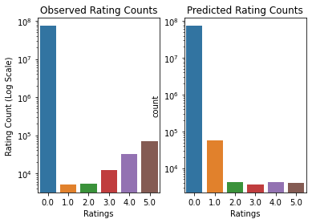

# Recommending Amazon Products

Using Recommendation System Techniques to Make Better Recommendations

## Background and Problem Statement
This relatively short weekly project was part of the recommendation systems module in the MIT Applied Data Science Program (MIT ADSP).  Data for over 7.8 million Amazon product ratings were provided and included the corresponding user ID and Product ID.  The task was to create a model which would recommend products to users using different recommendation techniques.

## Initial Processing and Exploratory Data Analysis
After initial examination of the data revealed that there were no missing or null values in the provided data, a bar chart was plotted to determine the quantity of each rating.  The number of unique users and the number of unique products were then extracted from the dataset, indicating that there were 4,201,696 unique users rating 476,002 unique products.

***Dataset Preparation:***  A new dataset was created with only product ratings from users who have submitted 50 or more ratings.  This limit ensured that each user had at least a small portfolio of information indicating the different products they had interacted with so that the recommendation systems could make more informed recommendations.  This reduced the size of the dataset drastically, with 1,540 unique users rating 48,190 unique products for a total of 125,871 ratings.  

***Data Formatting:*** A "final ratings matrix" of all 74,212,600 possible user/product combinations was created and the provided ratings were populated to their respective locations.  The matrix density was calculated to be 0.17%, indicating that the matrix was very sparse.  The vast majority of user and product combinations were unrated, and in such instances, a value of 0 was imputed into the matrix in place of a numerical rating.

## Recommendation System Models
Three different recommendation models were explored.

### Rank-Based Recommendation
This model was effectively a "Top Products" recommendation algorithm where the average rating for all products was computed in order to establish a product ranking.  A function was defined to recommend a specified number of top-ranking products with at least a specified number of product ratings.

### Collaborative Filtering
A function was defined to output a specified number of product recommendations for a given user based on the top-rated products of other users with similar product tastes.  A cosine similarity function was employed to calculate a "similarity score" which would act as a numerical comparison between an input user ID and all other user IDs to produce a ranked list of similar users.  The products rated by the most similar users - which were not already rated by the input user - were then aggregated until a specified number of product recommendations was reached.

### Collaborative Filtering Using Singular Value Decomposition (SVD)
***Description:***  Singular Value Decomposition (SVD) is a method employed in recommendation systems to use existing user/product rating data to uncover "latent features" which can be leveraged to predict product ratings from all users.  This includes the prediction of user ratings for products with which the users have not yet interacted.  

***Method:*** To do this, the final ratings matrix was passed through a Sparse Singular Value Decomposition (Scipy Sparse Linear Algebra "svds") with 50 latent features specified.  This produced U, Sigma, and V-transpose matrices which were then multiplied to create a predicted ratings matrix for all products from all users.  A function was then defined which would accept a specified user ID and a desired number of recommendations by presenting the top products for that user ID from the predicted ratings matrix.  The function also removed products that had already been rated by the user to eliminate redundancy.

***Evaluation:*** As a rudimentary means of evaluating the model, the average rating for each product was calculated for both the predicted and observed (actual) product ratings matrices.  These values were compared and the root mean squared error (RMSE) was calculated to quantify the error between the predicted and observed ratings.

## Conclusions
A variety of products were recommended for a few specified users using the three defined recommendation algorithms.  The root mean squared error for the SVD algorithm was calculated, though on its own, this error provides little information on the overall accuracy of the model.

# Additional Student Investigations Post-Submission

## Bottom Line Upfront (BLUF):
- Upon further inspection of the recommendations made by the SVD model, it can be shown that it's not producing useful results 
- The SVD model likely needs to be re-done after some brief manipulation of the number of latent features and research into other possible hyper-parameters to be tuned

This MIT ADSP weekly project assignment was unlike the others in that there was very little emphasis on measuring the accuracy of either the collaborative filtering or SVD models.  The only attempt that was made in the provided code was the RMSE calculation between the predicted and observed average product ratings.  This yielded an arbitrary result given that this was the only model of its nature for which an RMSE value was determined.  The only other information included in the code that could give insight into the model accuracy was the comparison of the predicted and observed product ratings for the first few prod IDs.  They are provided in the image below.

While it's difficult to judge the integrity of the analysis based on only a few average product ratings, it can be seen that the numbers are still very close to 0 (where a 0 rating indicates the product was not rated) which would suggest that the SVD method is not predicting as many product ratings for previously un-rated products as it should.

Another investigation examined differences between the observed and predicted ratings for a particular user ID.  This was helpful to determine if the model was able to replicate a user's actual product ratings.  Five of an arbitrary user's (user ID 100's) top-rated products from the observed ratings data are shown in the table below versus their predictions.  For the products shown, it can be seen that the model is not producing accurate results.

Taking a higher-level view, the purpose of the SVD model is to fill in missing information by predicting user ratings for products not yet rated.  Therefore, the model should be accomplishing two goals:
1. Approximating the actual (observed) user ratings for all rated products
2. Synthesizing ratings for unrated products - in this model, replacing 0s with numbers that can be rounded to integers ratings

To test this, the counts of each rating category for both the observed and predicted ratings matrices were plotted to verify the model was meeting the above two expectations.

From the count plots shown, it can be seen that there is no noticeable reduction in the number of unrated products (0 rating) in the predicted ratings matrix as compared to the observed ratings matrix.  Analysis indicates that the number of unrated products in the predicted ratings matrix (74,140,280) are actually greater than those in the observed ratings matrix (74,086,729).  Further, the rated products in the predicted matrix show a bias towards lower ratings while the observed ratings tended to be much higher, and often 5.  From this, the model is somehow removing legitimate ratings entirely, and mis-rating the remaining products.  From this, it can be concluded that the model is not accomplishing its goals and must be reworked.

## Next Steps:
Given current time constraints, this project will be re-published in the future after more research into a better implementation of SVD recommendation system methods is performed.  Additionally, a more robust accuracy testing protocol will need to be implemented with cross-validation methods on training and test datasets.

## Note Regarding MIT ADSP Weekly Projects:
**The code for this project was provided by the program, and the students were required to fill in the key lines of code and answer the provided prompts**
